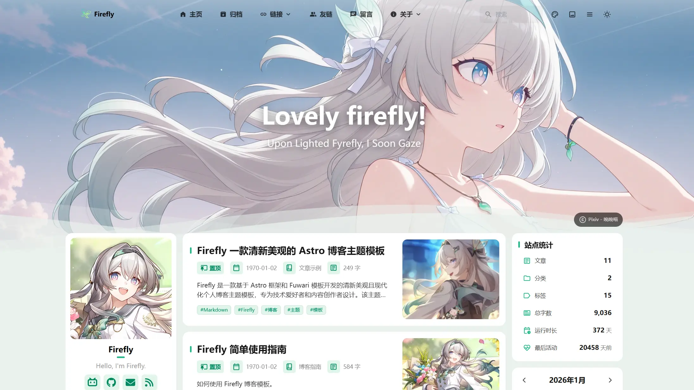

<div align="center">

# Firefly
> A Fresh and Beautiful Astro Blog Theme Template
> 
>  


>
> [](https://github.com/CuteLeaf/Firefly/stargazers)
[](https://github.com/CuteLeaf/Firefly/network/members)
[](https://github.com/CuteLeaf/Firefly/issues)
> 
> [](https://ko-fi.com/Z8Z41NQALY)
> 
> 
[](https://deepwiki.com/CuteLeaf/Firefly)
[](https://afdian.com/a/cuteleaf)
</div>


---
🚀 Quick Guide:
[**🖥️Live Demo**](https://firefly.cuteleaf.cn/) /
[**📝Documentation**](https://docs-firefly.cuteleaf.cn/) /
[**🍀My Blog**](https://blog.cuteleaf.cn)

📖 README:
**[简体中文](README.md)** | **[繁體中文](docs/README.zh-TW.md)** | **[English](README.en.md)** | **[日本語](docs/README.ja.md)** | **[Русский](docs/README.ru.md)** 

⚡ Static Site Generation: Ultra-fast loading speed and SEO optimization based on Astro

🎨 Modern Design: Clean and beautiful interface with customizable theme colors

📱 Mobile-Friendly: Perfect responsive experience with mobile-specific optimizations

🔧 Highly Configurable: Most features can be customized through configuration files



>[!TIP]
>In important layouts, Firefly innovatively adds dual sidebars, article grid (multi-column) layout, masonry layout,
>
>Includes site statistics, calendar component, table of contents and other widgets to enrich the sidebar,
>
>While also retaining fuwari layout system, freely switchable in the configuration file.
>
>**For more layout configurations and demos, please see: [Firefly Layout System Details](https://firefly.cuteleaf.cn/posts/firefly-layout-system/)**

## ✨ Features

### Core Features

- [x] **Astro + Tailwind CSS** - Ultra-fast static site generation based on modern tech stack
- [x] **Smooth Animations** - Swup page transition animations for silky smooth browsing experience
- [x] **Responsive Design** - Perfect adaptation for desktop, tablet and mobile devices
- [x] **Multi-language Support** - i18n internationalization, supports Simplified Chinese, Traditional Chinese, English, Japanese, Russian
- [x] **Full-text Search** - Client-side search based on Pagefind, supports article content indexing.

### Personalization
- [x] **Sidebar** - Supports single sidebar, dual sidebar configuration
- [x] **Article Layout** - Supports list (single column) and grid (multi-column/masonry) layout
- [x] **Font Management** - Custom font support with rich font selector
- [x] **Footer Configuration** - HTML content injection, fully customizable
- [x] **Light/Dark Mode** - Supports light/dark/system three modes
- [x] **Navbar Customization** - Logo, title, links fully customizable
- [x] **Wallpaper Mode Switching** - Banner wallpaper, fullscreen wallpaper, solid background
- [x] **Theme Color Customization** - 360° hue adjustment

### Page Components
- [x] **Guestbook** - Supports guestbook page
- [x] **Announcement Bar** - Supports sidebar announcement notification
- [x] **Mascot** - Supports both Spine and Live2D animation engines
- [x] **Site Statistics** - Displays article, category, tag counts, total word count, etc.
- [x] **Site Calendar** - Displays current month calendar and published articles for the month
- [x] **Sponsor Page** - Sponsor link redirection, payment QR codes display, sponsor list, in-article sponsor button
- [x] **Share Poster** - Supports generating beautiful article share posters
- [x] **Sakura Effect** - Supports sakura effect, fullscreen sakura animation
- [x] **Friend Links** - Beautiful friend links display page
- [x] **Ad Component** - Supports custom sidebar advertising content
- [x] **Bangumi** - Display anime and game tracking based on Bangumi API
- [x] **Comment System** - Integrates Twikoo, Waline, Giscus, Disqus, Artalk comment systems
- [x] **Visit Counter** - Supports calling Waline, Twikoo built-in visit tracking
- [x] **Music Player** - Based on APlayer, supports local music and Meting API online music

### Content Enhancement
- [x] **Image Lightbox** - Fancybox image preview functionality
- [x] **Floating TOC** - Dynamically displays article table of contents, supports anchor jumping, shown when sidebar TOC is hidden
- [x] **Email Protection** - Prevent automated crawlers from directly scraping email addresses to avoid spam
- [x] **Sidebar TOC** - Dynamically displays article table of contents, supports anchor jumping
- [x] **Enhanced Code Blocks** - Based on Expressive Code, supports code folding, line numbers, language identification
- [x] **Math Formula Support** - KaTeX rendering engine, supports inline and block formulas
- [x] **Random Cover Images** - Supports fetching random cover images via API
- [x] **Markdown Extensions** - More Markdown extension syntax support

### SEO
- [x] **SEO Optimization** - Complete meta tags and structured data
- [x] **RSS Feed** - Automatically generates RSS Feed
- [x] **Sitemap** - Automatically generates XML Sitemap with page filtering configuration

## 📝 Planned...

- [ ] **Refactor Live2D Mascot**
- [ ] **Continuous Animation Smoothness Optimization**
- [ ] More features in continuous development...

If you have useful features and optimizations, please submit a [Pull Request](https://github.com/CuteLeaf/Firefly/pulls)

## 🚀 Quick Start

### Requirements

- Node.js ≤ 22
- pnpm ≤ 9

### Local Development

1. **Clone the repository:**
   ```bash
   git clone https://github.com/Cuteleaf/Firefly.git
   cd Firefly
   ```
   
   **First [Fork](https://github.com/CuteLeaf/Firefly/fork) to your own repository then clone (recommended). Don't forget to Star before Fork!**

   ```bash
   git clone https://github.com/you-github-name/Firefly.git
   cd Firefly
   ```
3. **Install dependencies:**
   ```bash
   # Install pnpm if not installed
   npm install -g pnpm
   
   # Install project dependencies
   pnpm install
   ```

4. **Configure blog:**
   - Edit configuration files in `src/config/` directory to customize blog settings

5. **Start development server:**
   ```bash
   pnpm dev
   ```
   Blog will be available at `http://localhost:4321`

### Platform Hosting Deployment
- **Refer to the [official guide](https://docs.astro.build/en/guides/deploy/) to deploy your blog to Vercel, Netlify, GitHub Pages, Cloudflare Pages, EdgeOne Pages, etc.**

   Framework Preset: `Astro`

   Root Directory: `./`

   Output Directory: `dist`

   Build Command: `pnpm run build`

   Install Command: `pnpm install`

## 📖 Configuration

> 📚 **Detailed Configuration Documentation**: Check [Firefly Documentation](https://docs-firefly.cuteleaf.cn/) for complete configuration guide

### Setting Website Language

To set the default language for your blog, edit the `src/config/siteConfig.ts` file:

```typescript
// Define site language
const SITE_LANG = "zh_CN";
```

**Supported language codes:**
- `zh_CN` - Simplified Chinese
- `zh_TW` - Traditional Chinese
- `en` - English
- `ja` - Japanese
- `ru` - Russian

### Configuration File Structure

```
src/
├── config/
│   ├── index.ts              # Configuration index file
│   ├── siteConfig.ts         # Site basic configuration
│   ├── backgroundWallpaper.ts # Background wallpaper configuration
│   ├── profileConfig.ts      # User profile configuration
│   ├── commentConfig.ts      # Comment system configuration
│   ├── announcementConfig.ts # Announcement configuration
│   ├── licenseConfig.ts      # License configuration
│   ├── footerConfig.ts       # Footer configuration
│   ├── FooterConfig.html     # Footer HTML content
│   ├── expressiveCodeConfig.ts # Code highlighting configuration
│   ├── sakuraConfig.ts       # Sakura effect configuration
│   ├── fontConfig.ts         # Font configuration
│   ├── sidebarConfig.ts      # Sidebar layout configuration
│   ├── navBarConfig.ts       # Navbar configuration
│   ├── musicConfig.ts        # Music player configuration
│   ├── pioConfig.ts          # Mascot configuration
│   ├── adConfig.ts           # Ad configuration
│   ├── friendsConfig.ts      # Friend links configuration
│   ├── sponsorConfig.ts      # Sponsor configuration
│   └── coverImageConfig.ts   # Article cover image configuration
```


## ⚙️ Article Frontmatter

```yaml
---
title: My First Blog Post
published: 2023-09-09
description: This is the first post of my new Astro blog.
image: ./cover.jpg  # Or use "api" to enable random cover images
tags: [Foo, Bar]
category: Front-end
draft: false
lang: zh-CN      # Only set when article language differs from site language in `siteConfig.ts`
pinned: false    # Pin article
comment: true    # Enable comments
---
```

## 📖 Markdown Extensions

In addition to the default [GitHub Flavored Markdown](https://github.github.com/gfm/) support in Astro, there are some additional Markdown features:

- Admonitions - Supports configuration for GitHub, Obsidian, and VitePress themes ([Preview and Usage](https://firefly.cuteleaf.cn/posts/markdown-extended/))
- GitHub Repository Cards ([Preview and Usage](https://firefly.cuteleaf.cn/posts/markdown-extended/))
- Enhanced Code Blocks based on Expressive Code ([Preview](http://firefly.cuteleaf.cn/posts/code-examples/) / [Documentation](https://expressive-code.com/))

## 🧞 Commands

All commands need to be executed in the project root directory:

| Command                    | Action                                              |
|:---------------------------|:----------------------------------------------------|
| `pnpm install`             | Install dependencies                                |
| `pnpm dev`                 | Start local development server at `localhost:4321`  |
| `pnpm build`               | Build site to `./dist/`                             |
| `pnpm preview`             | Preview built site locally                          |
| `pnpm check`               | Check for errors in code                            |
| `pnpm format`              | Format your code using Biome                        |
| `pnpm new-post <filename>` | Create new article                                  |
| `pnpm astro ...`           | Execute `astro add`, `astro check` and other commands |
| `pnpm astro --help`        | Display Astro CLI help                              |

## 🙏 Acknowledgments

- Special thanks to [saicaca](https://github.com/saicaca) for developing the [fuwari](https://github.com/saicaca/fuwari) template, which Firefly is based on
- Referenced blogger [Kasuka](https://kasuha.com)'s [Bangumi Collection Display](https://kasuha.com/posts/fuwari-enhance-ep2/) and [Email Protection/Image Title](https://kasuha.com/posts/fuwari-enhance-ep1/) solutions
- Referenced [Mizuki](https://github.com/matsuzaka-yuki/Mizuki)'s banner title, multi-level menu navbar, sakura effect, KaTeX, and Fancybox solutions
- Built with [Astro](https://astro.build) and [Tailwind CSS](https://tailwindcss.com)
- Uses [MetingJS](https://github.com/metowolf/MetingJS) and [APlayer](https://github.com/MoePlayer/APlayer) music player
- Uses Chibi `Firefly` mascot spine model provided by Bilibili creator [公公的日常](https://space.bilibili.com/3546750017080050)
- Icons from [Iconify](https://iconify.design/)
- Firefly-related image assets are copyrighted by [miHoYo](https://www.mihoyo.com/), the developer of ["Honkai: Star Rail"](https://sr.mihoyo.com/).

## 📝 License

This project is licensed under the [MIT license](https://mit-license.org/). See the [LICENSE](./LICENSE) file for details.

Originally forked from [saicaca/fuwari](https://github.com/saicaca/fuwari). Thanks to the original author for their contributions. The original project is licensed under the [MIT License](https://mit-license.org/)

**Copyright Notice:**
- Copyright (c) 2024 [saicaca](https://github.com/saicaca) - [fuwari](https://github.com/saicaca/fuwari)
- Copyright (c) 2025 [CuteLeaf](https://github.com/CuteLeaf) - [Firefly](https://github.com/CuteLeaf/Firefly)

Under the MIT license, you are free to use, modify, and distribute the code, but you must retain the above copyright notice.

## 🍀 Contributors

Thanks to the following contributors for their contributions to this project. If you have any questions or suggestions, please submit an [Issue](https://github.com/CuteLeaf/Firefly/issues) or [Pull Request](https://github.com/CuteLeaf/Firefly/pulls).

><a href="https://github.com/CuteLeaf/Firefly/graphs/contributors">
>  
></a>

Thanks to the following contributors for their contributions to the original project [fuwari](https://github.com/saicaca/fuwari), which laid the foundation for this project.

><a href="https://github.com/saicaca/fuwari/graphs/contributors">
>  
></a>

## ⭐ Star History

[](https://star-history.com/#CuteLeaf/Firefly&Date)


<!-- ALL-CONTRIBUTORS-LIST:START - Do not remove or modify this section -->
<!-- prettier-ignore-start -->
<!-- markdownlint-disable -->

<!-- markdownlint-restore -->
<!-- prettier-ignore-end -->

<!-- ALL-CONTRIBUTORS-LIST:END -->
