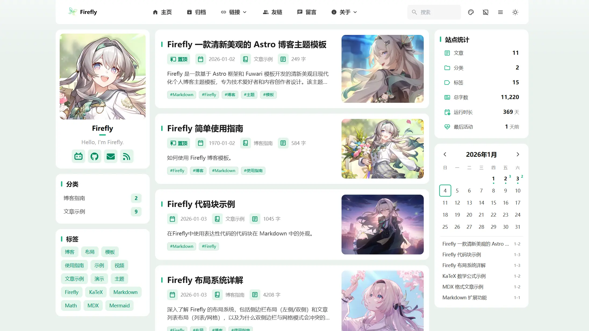
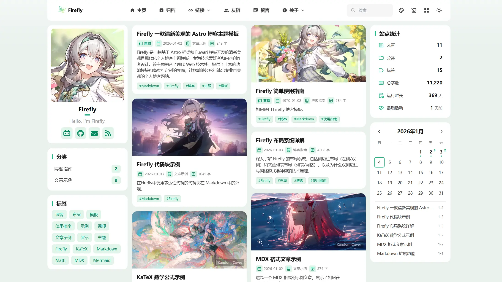

## 📖 概述

Firefly 提供了灵活的布局系统，允许您根据内容需求和个人喜好自定义博客的视觉呈现方式。布局系统主要包括**侧边栏布局**和**文章列表布局**两个维度，它们相互配合，共同决定了页面的整体结构。

本文将详细介绍 Firefly 的各种布局模式、它们的特点、使用场景，以及不同布局组合的效果。

---

## 一、侧边栏布局系统

侧边栏是博客页面的重要组成部分，用于展示导航、分类、标签、统计信息等辅助内容。Firefly 支持两种侧边栏布局模式。

### 1.1 左侧边栏模式 (position: "left")

#### 特点

- 侧边栏固定在页面左侧
- 主内容区域位于右侧
- 符合从左到右的阅读习惯
- 适合展示导航和分类等重要信息

#### 布局结构


#### 适用场景

- 传统博客风格
- 强调导航和分类的博客
- 需要突出用户资料的个人博客
- 内容为主，辅助信息次之的场景

:::tip
开启左侧单侧边栏后，位于文章详情页右侧边栏的文章目录导航将失效

会改用浮动目录导航替代，需要手动点击弹出目录导航

但可以通过showRightSidebarOnPostPage配置是否在文章详情页显示右侧边栏

当position为left时开启此项后，文章详情页将显示双侧边栏，主页等其他页面保持左侧单侧边栏

适用在只想用左侧单侧栏，但在文章详情页想用右侧栏的目录等组件的场景
:::


#### 配置示例

```typescript
// src/config/sidebarConfig.ts
export const sidebarLayoutConfig: SidebarLayoutConfig = {
  enable: true,
  position: "left", // 左侧边栏
  showRightSidebarOnPostPage: true, // 是否在文章详情页显示右侧边栏
};
```

---

### 1.2 双侧边栏模式 (position: "both")

#### 特点

- 左右两侧同时存在侧边栏
- 主内容区域位于中间
- 最大化利用屏幕空间
- 可以展示更多辅助信息
- 适合宽屏显示器

#### 布局结构



#### 适用场景

- 宽屏桌面端浏览
- 信息密集型博客
- 需要展示大量辅助内容
- 专业性强的技术博客


#### 配置示例

```typescript
// src/config/sidebarConfig.ts
export const sidebarLayoutConfig: SidebarLayoutConfig = {
  enable: true,
  position: "both", // 双侧边栏
```

---

## 二、文章列表布局系统

文章列表是博客首页和归档页的核心内容，Firefly 提供两种展示方式，并支持多种网格配置。

### 2.1 列表模式 (defaultMode: "list")

#### 特点

- 单列纵向排列
- 显示文章封面图
- 展示更多文章摘要
- 适合深度阅读

#### 列表布局结构


#### 优点

- ✅ 视觉冲击力强，封面图吸引眼球
- ✅ 可以展示更多文章信息（摘要、标签等）
- ✅ 适合图片内容丰富的博客
- ✅ 移动端友好，单列更易阅读
- ✅ 兼容所有侧边栏配置（单侧、双侧）

#### 配置示例

```typescript
// src/config/siteConfig.ts
export const siteConfig: SiteConfig = {
  postListLayout: {
    defaultMode: "list", // 列表模式
    allowSwitch: true,   // 允许用户切换
  },
};
```

---

### 2.2 网格模式 (defaultMode: "grid")

#### 特点

- 多列横向排列（支持 2 列或 3 列）
- 紧凑布局，信息密度高
- 适合快速浏览

#### 2.2.1 双列网格 (Columns: 2)

这是网格模式的默认配置，适合大多数场景。


#### 2.2.2 三列网格 (Columns: 3) ✨ New

在宽屏设备上，您可以开启三列网格模式，进一步提高信息密度。


**⚠️ 注意**：三列网格模式仅在**左侧边栏模式**（或无侧边栏）下生效。如果您启用了双侧边栏，系统将自动回退到双列网格，以保证文章卡片有足够的展示宽度。

#### 配置示例

```typescript
// src/config/siteConfig.ts
export const siteConfig: SiteConfig = {
  postListLayout: {
    defaultMode: "grid",
    allowSwitch: true,
    grid: {
      masonry: true,  // 开启瀑布流
      columns: 3,     // 设置为 3 列模式（仅单侧边栏生效）
    },
  },
};
```

---

### 2.3 瀑布流布局 (Masonry)

Firefly 的网格模式内置了智能瀑布流布局支持，解决了网格布局中因图文混合文章导致的卡片高度不一致导致的空白问题。



- **智能排版**：采用 Z 字形分布（左右交替），严格保持文章的时间顺序。
- **消除空白**：通过绝对定位精确计算每个卡片的位置，让卡片紧贴上一行的卡片，消除垂直方向的空白间隙。
- **配置灵活**：您可以在 `siteConfig.ts` 中通过 `postListLayout.grid.masonry` 选项自由开启或关闭此功能。

---

## 三、布局组合指南

Firefly 允许您自由组合侧边栏和文章列表布局。以下是各种组合的效果说明。

### 3.1 左侧边栏 + 网格模式

这是最灵活的组合。您可以选择 2 列或 3 列网格。

- **2 列模式**：经典的网格布局，卡片宽度适中，阅读舒适。
- **3 列模式**：适合宽屏（≥1024px），单屏展示更多内容，视觉效果震撼。

### 3.2 双侧边栏 + 网格模式

在旧版本中，此组合被禁用。但在最新版 Firefly 中，我们解除了限制，允许双侧边栏与网格模式共存。


**特点与限制**：
- **强制双列**：即使您配置了 `columns: 3`，在此模式下也会强制显示为 2 列。
- **空间紧凑**：由于左右都有侧边栏，中间的主内容区域相对较窄。
- **信息密度极高**：这是信息密度最高的布局方式，适合需要同时展示大量导航信息和文章列表的站点。

### 3.3 布局选择建议

| 侧边栏模式 | 文章列表模式 | 推荐度 | 适用场景 |
|-----------|------------|--------|---------|
| 左侧边栏   | 列表模式    | ⭐⭐⭐⭐⭐ | 摄影、设计、生活类博客，强调图片和沉浸感 |
| 左侧边栏   | 2列网格     | ⭐⭐⭐⭐⭐ | 技术、笔记类博客，平衡阅读与检索效率 |
| 左侧边栏   | 3列网格     | ⭐⭐⭐⭐⭐ | 内容量大的站点，宽屏体验极佳 |
| 双侧边栏   | 列表模式    | ⭐⭐⭐⭐⭐ | 需要展示大量侧边栏信息的站点 |
| 双侧边栏   | 2列网格     | ⭐⭐⭐⭐⭐ | 极客风格，追求最高信息密度 |

---

## 四、响应式布局行为

Firefly 的布局系统具有智能的响应式设计，会根据屏幕尺寸自动调整。

### 4.1 智能降级规则

为了保证最佳阅读体验，系统会在屏幕变窄时自动调整布局：

1. **3 列网格 -> 2 列网格**：当屏幕宽度不足以容纳 3 列时（或开启双侧边栏时），自动降级为单列表模式。
2. **网格模式 -> 列表模式**：当屏幕宽度小于 1200px（平板和手机）时，网格模式会自动切换为单列列表模式，以保证卡片内容的可读性。
3. **双侧边栏 -> 左侧边栏**：当屏幕宽度小于 1200px 时，右侧边栏会自动隐藏，文章目录导航会切换成浮动目录导航。

---

## 五、常见问题

### Q1: 为什么我配置了 3 列网格，但只显示 2 列？

**A**: 请检查以下情况：
1. 是否开启了双侧边栏（`position: "both"`）？双侧边栏模式下强制 2 列。
2. 屏幕宽度是否足够？3 列模式通常需要 ≥1024px 的宽度。

### Q2: 为什么在手机上看不到网格效果？

**A**: 为了保证阅读体验，Firefly 在屏幕宽度小于 1200px 时会自动强制切换为列表模式。手机屏幕太窄，不适合展示多列网格。

### Q3: 布局切换按钮在哪里？

**A**: 布局切换按钮位于导航栏右侧。它仅在屏幕宽度 ≥ 1200px 时显示，因为在小屏幕上系统强制使用列表模式，无需切换。

---

## 六、总结

Firefly 的新版布局系统给予了您更大的自由度。无论是追求视觉冲击力的**三列网格**，还是追求信息密度的**双侧边栏网格**，您都可以通过简单的配置实现。

我们建议您根据自己的内容类型和目标读者的设备偏好，尝试不同的组合，找到最适合您的博客形态。

---

## 相关链接

- 📚 [侧边栏配置文档](https://docs-firefly.cuteleaf.cn/config/sidebarConfig-usage/)
- 📚 [站点配置文档](https://docs-firefly.cuteleaf.cn/config/siteConfig-usage/)
- 🏠 [Firefly 官方文档](https://docs-firefly.cuteleaf.cn/)
- ⭐ [Firefly GitHub](https://github.com/CuteLeaf/Firefly)
